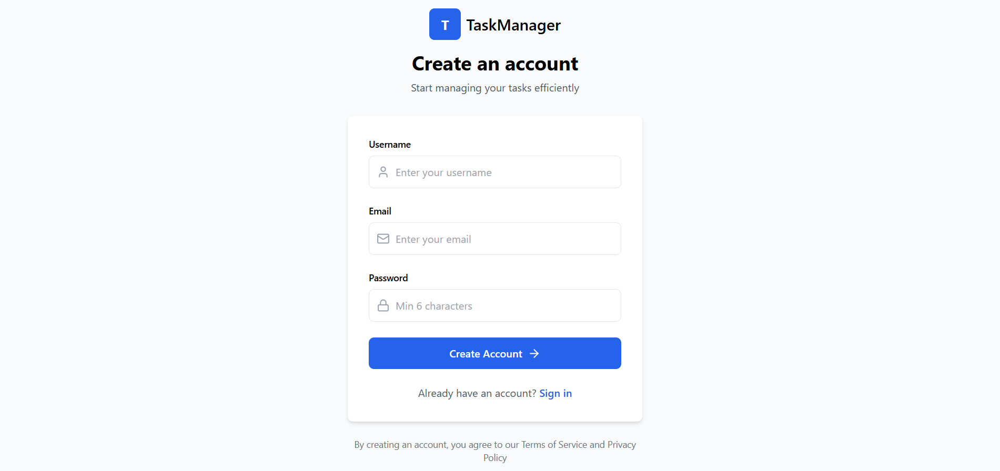
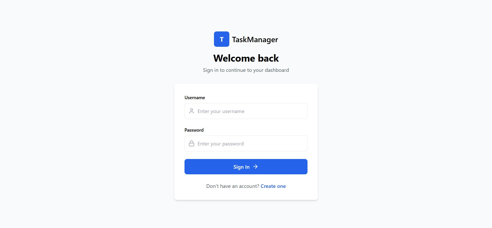
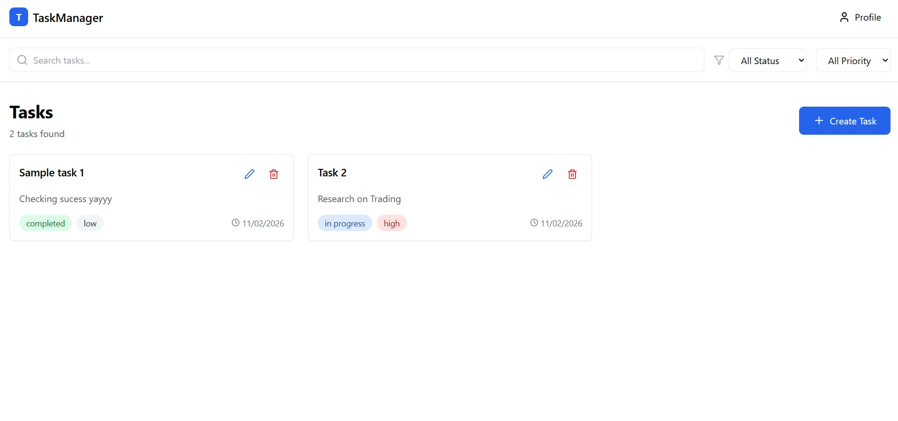

# PrimeDesk – Full Stack Task Management Web App

A scalable, secure, and responsive task management web application. The project demonstrates full-stack development skills with authentication, a dashboard, CRUD operations, and a modern UI.

---

## 🚀 Live Features

### 🔐 Authentication

* User Registration & Login
* JWT-based Authentication
* Protected Routes
* Secure Logout

### 📋 Task Management

* Create, Read, Update, Delete (CRUD) Tasks
* Filter by Status & Priority
* Search Tasks
* Pagination

### 👤 Profile

* Profile Modal
* View Username & Email
* Logout from Profile

### 🎨 UI/UX

* Responsive Design (Tailwind CSS)
* Figma-based Layout
* Modern Dashboard Interface
* Mobile Friendly

---

## 🛠 Tech Stack

### Frontend

* React (Vite)
* React Router
* Tailwind CSS
* Axios
* Lucide Icons

### Backend

* Django
* Django REST Framework
* JWT Authentication (SimpleJWT)

### Database

* Supabase (PostgreSQL)

### Tools

* Git & GitHub
* Postman (API Testing)

---

## 📁 Project Structure

```
PrimeDesk/
 ├── backend/        # Django Backend
 ├── frontend/       # React Frontend
 ├── .gitignore
 └── README.md
```

### Frontend Structure

```
frontend/src/
 ├── api/           # Axios setup
 ├── auth/          # Auth context & protected routes
 ├── components/    # Reusable UI components
 ├── pages/         # Login, Register, Dashboard
 └── App.jsx
```

---

## 🔐 Security Practices

* Password Hashing (Django default)
* JWT Authentication
* Token Validation Middleware
* Protected Routes
* Auto Logout on Token Expiry
* Environment Variables for Secrets

---

## ⚙️ Error Handling & Validation

### Backend

* DRF Serializers for Input Validation
* Proper HTTP Status Codes
* Custom Error Messages

### Frontend

* Try/Catch in API Calls
* Inline Error Messages
* Loading States
* Axios Interceptors

---

## 📈 Scalability & Architecture

* Modular Component Structure
* Centralized API Layer
* Context-based Authentication
* Reusable UI Components
* Separation of Concerns
* Easily Extendable for Future Features

Future Scalability Options:

* Role-Based Access Control
* Team/Project Management
* Notifications
* Analytics Dashboard

---

## 🧪 API Documentation (Postman)

A complete Postman collection is included:

📄 [primtrade-postman-collection.json](https://github.com/arpitajana1220/primetrade-task-manager/blob/master/primtrade-postman-collection.json)

### Includes:

* Register
* Login
* Refresh Token
* Get Profile
* CRUD Tasks

### Environment Variables

```
base_url = http://127.0.0.1:8000
access_token = <JWT Token>
refresh_token = <Refresh Token>
task_id = <Task ID>
```

---

## 💻 Setup Instructions

### Prerequisites

* Node.js (v18+ recommended)
* Python (3.9+)
* Git

---

### Backend Setup

```bash
cd backend
python -m venv venv
venv\Scripts\activate
pip install -r requirements.txt
python manage.py migrate
python manage.py runserver
```

Backend runs at:

```
http://127.0.0.1:8000
```

---

### Frontend Setup

```bash
cd frontend
npm install
npm run dev
```

Frontend runs at:

```
http://localhost:5173
```

---

## 🔗 Frontend–Backend Integration

* Axios used for API communication
* JWT stored in localStorage
* Auth token sent via Authorization headers
* Centralized Axios Interceptors
* Automatic logout on unauthorized access

---

## 🚀 Production Scaling Strategy

For production deployment:

### Frontend

* Build with `npm run build`
* Deploy on Vercel/Netlify
* CDN Integration

### Backend

* Dockerize Django App
* Deploy on AWS/GCP/DigitalOcean
* Use Gunicorn + Nginx
* Enable HTTPS

### Database

* Supabase Production Instance
* Read Replicas
* Automated Backups

### Monitoring

* Logging
* Error Tracking (Sentry)
* Performance Monitoring

---

## 🧠 Design Decisions

### Authentication

* JWT chosen for stateless auth
* Refresh tokens for security

### UI

* Tailwind CSS for fast, scalable styling
* Component-driven architecture

### Backend

* Django REST Framework for rapid development
* Serializer-based validation

### State Management

* React Context for Auth
* Local State for UI

---

## 📸 Screenshots

Register

Login

Dashboard



---

## 📄 License

This project is developed for evaluation purposes under Primetrade.ai assignment.

---

## ✅ Evaluation Checklist
* ✔ Responsive UI
* ✔ Authentication System
* ✔ JWT Security
* ✔ CRUD Operations
* ✔ API Documentation
* ✔ Scalable Architecture
* ✔ Clean Codebase
* ✔ Proper Git Practices

---

Thank you for reviewing this project! 🙌
